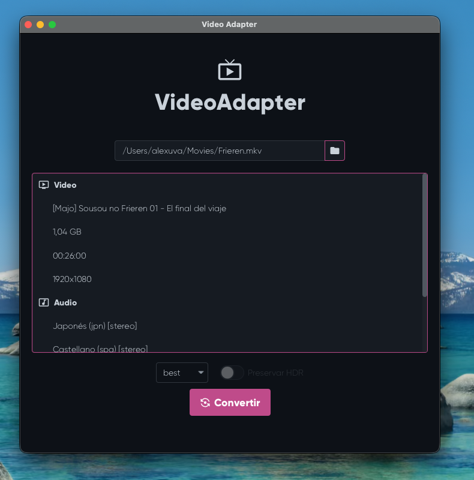

# VideoAdapter

A desktop application for converting video files using FFmpeg, with GPU acceleration support and an automatic HDR detection.



## Features

- **GPU acceleration** — automatically detects your GPU (NVIDIA, AMD, Intel) and uses the appropriate hardware encoder
- **HDR support** — detects HDR content and lets you preserve it or convert to SDR
- **Multiple quality modes**:
  - `best` — highest quality, copies all audio tracks and subtitles
  - `better` — good quality with AC3 audio encoding and broad compatibility
- **Stream info** — displays video, audio, and subtitle tracks before converting
- **Progress bar** — shows real-time conversion progress

## Requirements

- Windows
- No need to install FFmpeg — it's bundled with the app

## Download

Grab the latest release from the [Releases](../../releases) page and extract the zip.

## Usage

1. Open `VideoAdapter.exe`
2. Select a video file
3. Choose quality mode and HDR options if available
4. Click **Convertir** and choose where to save the output

## Building from source

Requires JDK 21.

```bash
mvn clean package
mvn javafx:jlink
jpackage \
  --runtime-image target/app \
  --name VideoAdapter \
  --module com.alexuva.app.videoadapter/com.alexuva.app.videoadapter.VideoAdapterApplication \
  --type app-image \
  --dest output/
```

Or push a `v*` tag to trigger the GitHub Actions build.

## Tech stack

- Java 21
- JavaFX 21
- [AtlantaFX](https://github.com/mkpaz/atlantafx) — UI theme
- [Ikonli](https://github.com/kordamp/ikonli) — icons
- [ControlsFX](https://github.com/controlsfx/controlsfx) — additional controls
- FFmpeg — video processing
